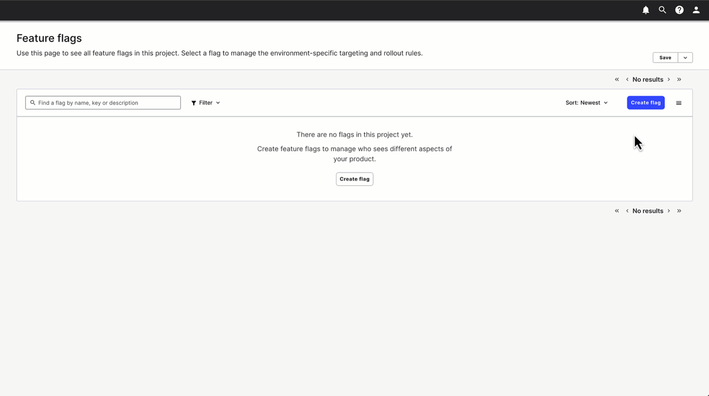
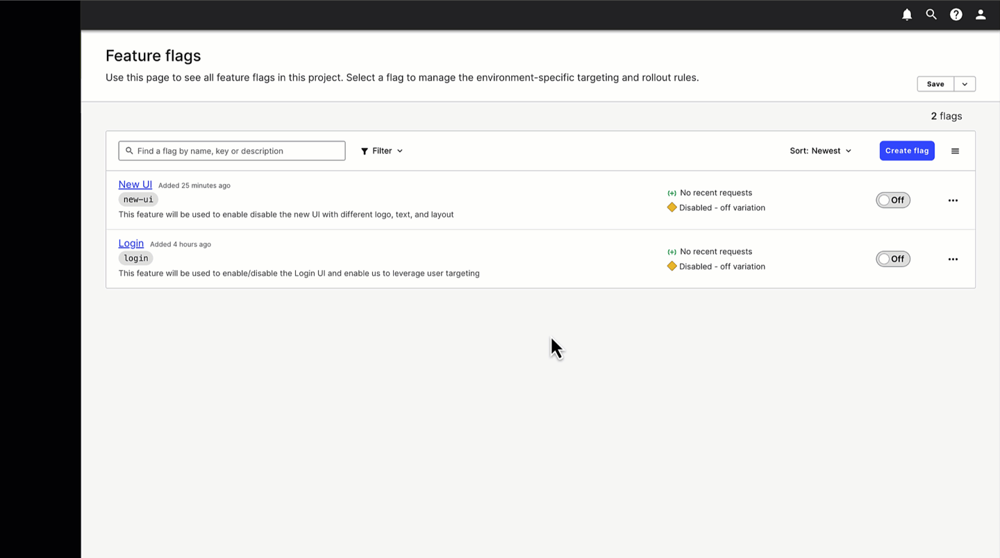
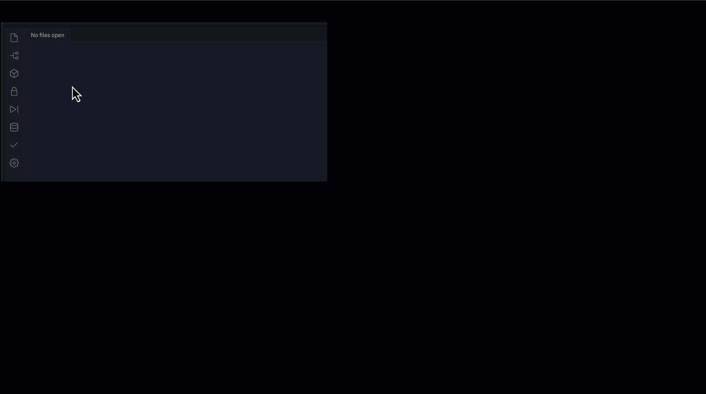

# Launching Darkly with a Vue (app)


This [Vue](https://vuejs.org/) application is designed to get you up and running with a working Vue app in no time flat and use use several feature flags to showcase the ability to release features quickly using [LaunchDarkly](https://www.launchdarkly.com) and super power your Vue app. 


If you found this repo on your own, checkout this blog post to read more about the new LaunchDarkly Vue SDK!
(TODO: insert blog post link here)

[TOC]

## Getting Started

### :gear: **Setup**
If you don't already have a LaunchDarkly account, sign up for a [free trial of LaunchDarkly](https://app.launchdarkly.com/signup) to explore creating Feature Flags and targeting users with changes. It's fast, easy, and there's no obligation to continue.


### :flags: **Creating flags**

Create the following feature flags within LaunchDarkly

* `login`

  - Create this flag as a `boolean` flag 

  - This feature flag will be used to enable the login UI that can be used to leverage targeting based on a user ID. 

    <details><summary>Click here to see how</summary>


      
    </details>

* `new-ui`

  - Create this flag as a `boolean` flag

  - This feature flag changes the view of the application out of the Osmo logo, introducing a new banner, image, and text.

    <details><summary>Click here to see how</summary>


    
    </details>

###  :shushing_face: **Secret time**

Get your LaunchDarkly Client-Side ID from the [LaunchDarkly console](https://app.launchdarkly.com/)

- :sunglasses:  Super cool way 

  -  `CMD+K` or `CTRL+K`, typing "copy" and selecting `Copy SDK key for the current environment` and selecting **"Client-side ID"** from the list. 

  <details><summary>Click here to see how</summary>


   
  </details>

- :hand: Manual way 

  - You can find the Client-Side ID under `Account Settings > Projects > <Your Project Name>`
  - Click your project name
  - Click the `Client-side ID` for the key you want
    (This will add it to your clipboard for easy copy and paste.)

- **:warning: Potential gotcha**: 
  make sure you got the **"Client-side ID"** from the LaunchDarkly console and not one of the other keys! 

  

### :shipit: Shipping with Flags

:world_map: Choose your own adventure

1. Run locally

   <details><summary>Click here to see how</summary>


   1. Get the code

      ```shell
      # just run this command to quickly pull the source code locally
      # you have to have Node and NPM installed already, but you probably already do if you work with Vue
      npx degit halex5000/launching-darkly-with-a-vue
      ```

   2. Setup the env

      ```shell
      # go into the directory you just created by pulling the code
      cd launching-darkly-with-a-vue
      
      # this will make the terminal wait for your client ID to be pasted 
      read client_id
      
      # paste your client ID into the terminal and hit enter
      
      # this will write your client ID to your .env file, which is ignored by the .gitignore
      echo "VITE_CLIENT_ID=$client_id" > .env                                                                                  
      ```

   3. Install all the things

      ```shell
      npm install
      ```

   4. Run your app!

      ```shell
      # this will set you up for hot reloading so as you change things, the app will auto-update
      npm start
      ```

    </details>


2. Run in replit

   <details><summary>Click here to see how</summary>


   1. Go check out this Repl I made: https://replit.com/@halex5000/Launching-Darkly-with-a-Vue

   2. Fork it.

   3. Add a secret into your Repl `VITE_CLIENT_ID` and paste the Client Side ID you copied from the LaunchDarkly console

      <details><summary>Click here to see how</summary>


        
    
      </details>

   4. Run your Repl!

    </details>
​      

### :champagne: Let's pop some flags


If you've set everything up, you should be ready to roll!

From here, we can enable our new feature and observe how our application changes based on a new feature being rolled out. 

* `login`
  - Enable this feature (in case you don't know how yet, [click here](https://docs.launchdarkly.com/home/getting-started/toggle))
    - You should now have a prompt on the screen indicating you're anonymous and a button to Login
    - Click Login
    - Enter any name you want here and you should see the screen update to tell you who you have logged in as.
    - We'll use this feature to allow for specific user targeting
  - :smiley: you just popped your first flag and saw a nearly instantaneous change in the UI :boom: thanks to the combined power of the reactive nature of Vue and the LaunchDarkly's global super powered Flag Delivery Network (FDN)
  
* `new-ui`
  - Create a `targeting rule` for your user, for this feature flag. ([click here to read how](https://docs.launchdarkly.com/home/flags/targeting-rules))
  
  - Ensure you set the `Default Rule` to false to ensure that only users who are targeted receive feature changes.
  
  - :raised_hands: You should see a new image on the left side of the app now 
    - enter a new username and click login again or clear the existing login
    
    - if the new user isn't targeted you should no longer see the image on the left
    
      

## Congratulations, you're launching darkly with a Vue!

Now that you've got a working Vue app and you're seeing features powered by LaunchDarkly, let's unpack a little of how LaunchDarkly's Vue SDK works with Vue.


### :new: In the beginning

First, in our app, we initialize the LaunchDarkly client using [Vue's Plugin system](https://vuejs.org/guide/reusability/plugins.html) when our app starts up. 
You can find this code in `src/main.js`, but here's how it works:

```javascript
import { createApp } from 'vue'
import App from './App.vue'
import { LDPlugin } from 'launchdarkly-vue-client-sdk'

const app = createApp(App);

if (import.meta.env.VITE_CLIENT_ID) {  
  const clientSideID = import.meta.env.VITE_CLIENT_ID,
  
  const launchDarklyPluginOptions = { 
    clientSideID,
  };
  
  app.use(LDPlugin, launchDarklyPluginOptions)
}

app.mount('#app')
```
:incoming_envelope: Let's unpack what's going on up there :arrow_up:
- our client ID is in our environment and Vite will only include an environment variable if it is prefixed with VITE which tells Vite that this is an environment variable intended for the client.
- there are a lot of things you can include in LaunchDarkly Plugin Options, but we only need the `clientSideID` for this example
  - [read more here](https://launchdarkly.github.io/vue-client-sdk/index.html#LDPluginOptions)
  - if we knew the user now, we could include it, but our user hasn't authenticated yet, so they're anonymous by default
  - the LaunchDarkly client will assign the user a UUID if they're anonymous and we don't assign a key for this user.

### :metal: Composing our masterpiece 


Let's peek into the app code and see how the SDK works with Vue to surface flags and tell the app when it's ready.

We're using [Vue's Composables](https://vuejs.org/guide/reusability/composables.html#what-is-a-composable) pattern to track the state of the LaunchDarkly client as well as flag values.

> In the context of Vue applications, a "composable" is a function that leverages Vue's Composition API to encapsulate and reuse **stateful logic**.

source: https://vuejs.org/guide/reusability/composables.html#what-is-a-composable

The SDK handles communicating with LaunchDarkly APIs, retries, error handling, and encapsulates the state management and caching for you, all you have to do is use the `use` functions to hook into this. 

Check this out these samples from `src/App.vue` to see how we use our composables from the SDK to make integrating the flags into our code so simple

#### :radioactive: You're so... reactive

:bulb: - <small>the code is also commented with the following notes</small> 

```vue
<!-- abridged version of src/App.vue script for illustration purposes -->
<script setup>
  import { ref } from 'vue';
  import { useLDReady, useLDFlag } from 'launchdarkly-vue-client-sdk';
  let ldReady = ref(false);
  let loginEnabled = ref(false);
  let newLogoEnabled = ref(false);
  
  try {
    ldReady = useLDReady();
    loginEnabled = useLDFlag('login', false);
    newLogoEnabled = useLDFlag('new-ui', false);
  } catch (error) {
    console.error(error);
  }
</script>
```
:incoming_envelope: Let's unpack what's going on up there :arrow_up:
- the composables, those functions prefixed with `use` need to be in the `setup block` and more importantly, they have to run at `setup` time. I learned this the hard way because I had a `use` in the setup block, but it wasn't executed until later and that errored out because the client was not initializing when I ran the function later.
- `useLDReady` is a function which allows you to react to whether the LaunchDarkly client is ready to use or not and returns you a `reactive` object so Vue can observe changes to it's value.
- `useLDFlag` is a function which allows you to evaluate a LaunchDarkly feature flag and returns you a `reactive` object so Vue can observe changes to it's value.


#### :atom: When it's time to change
<small>You've got to rearrange (your components)</small> 

```vue
<!-- abridged version of src/App.vue template for illustration purposes -->
<template>
  <v-app>  
    <v-app-bar app>
      <div class="d-flex justify-center align-center w-100">
        <h1>Launching Darkly with a Vue</h1>
      </div>
    </v-app-bar>

    <v-main app class="w-100">
      <v-container fluid>
        <Login v-if="loginEnabled" />
        
      	<v-timeline>
          <TimeLineItem 
            title="LaunchDarkly"
            :subtitle="ldReady ? 'super-powering your features!' : `isn't working yet`"
            image="./white-osmo.png"
            dot-color="#FF386B"
            :icon="ldReady ? '' : mdi-emoticon-sad"
            :error="!ldReady ? `LaunchDarkly initialization failed, check your environment` : ''"
            :timelineIcon="ldReady ? 'mdi-checkbox-marked-circle' : 'mdi-alert-octagram'"
          />
  			</v-timeline>
  	</v-container>
  </v-main>
</template>
```
:incoming_envelope: Let's unpack what's going on up there :arrow_up:
-  `v-if` is a Vue directive that affects whether an element renders or not. In this case, we're using the reactive object, `loginEnabled`, to decide whether we render that component or not.

-  we kept it super simple and only used `Boolean` flags, but feature flags with LaunchDarkly can be **soooooo** much more.
   -  While `Boolean` is the default way we think about feature flags... on or off, let's take a quick dip into other choices here:
      -  `String` - we can use a feature flag to provide the content (text, icons, colors, classes) we display to the users
      -  `Number` - we can use a feature flag to provide numeric values for constraints, validation rules, sizing
      -  `JSON` - we can use a feature flag to provide JSON objects allowing for us to load configuration remotely from LaunchDarkly's Feature Delivery Network
   
-  we use the `:` in front of properties where we're using an expression, like evaluating the `Boolean` flag, `ldReady` to determine what to display to the user.

   :star: Imagine the power of not having to redeploy your app to change the experience, iconography, or language you display to your user

#### :disguised_face: New app, who this?

Identifying your user unlocks loads of potential for your feature management and the best part is that even if you don't know who your user is up front, you can update the LaunchDarkly client anytime when you get more information about your user.
```vue
<!-- abridged version of src/components/Login.vue for illustration purposes -->

<script setup>
  import { useLDFlag, useLDClient } from 'launchdarkly-vue-client-sdk'
  import { ref } from 'vue'

  const loginEnabled = useLDFlag('login', false);
  
  const client = useLDClient();

  let username = ref('anonymous');

  let showLoginDialog = ref(false);

  const form = {};

  const login = async () => {
      if (form.username) {
          username.value = form.username;
          form.username = '';
        
          const user = client.getUser();
        
          console.log('current user is', client.getUser());

          await client.identify({
            ...user, 
            key: username.value,
          });

          console.log('current user is', client.getUser());

          showLoginDialog.value = false;
      }
  }
	
  const clearUser = async () => {
      await client.identify({
          anonymous: true,
      });
      username.value = 'anonymous';
  }
</script>

<template>
  <v-card
    v-show="loginEnabled"
  >
  </v-card>
</template>
```
📨 Let's unpack what's going on up there ⬆️
- How we identified the user in the example above:
  - `useLDClient` - just like the other composables, this **must** be run in the `setup` block
  - `identify` - a function on the client for providing the user data to assist the SDK in the flag evaluation when targeting users
    - in one case, we identified the user by passing their `username` as the key of the user
    - in another case, we anonymized the user by simply passing `anonymous: true`
  
- `v-show` directive which informs Vue that it **should** render the element, but use the reactive object `loginEnabled` to control the display of the element.

  :star: by identifying your user, you've unlocked the ability to target users by any attributes meaning you can release your features in an ultra-granular controlled way.


## :dash: Just Like That

You saw how easy it is to build LaunchDarkly's Vue SDK into your Vue app. 

You used feature flags to supercharge your delivery by decoupling your release of features from deployment of your app.

You saw first-hand how you can choose who sees what features either turning them on for an entire userbase or releasing to a single user at a time and anywhere in between.

Finally, you saw the :zap: lightning fast :zap: response time from [LaunchDarkly's Flag Delivery Network](https://launchdarkly.com/blog/flag-delivery-at-edge/) where the changes to your flags are propagated around the world in just milliseconds.


## :information_desk_person: More to come

Stay tuned, there is more to come with our Vue SDK, but in the meantime, here are some things to fuel your feature flagging journey

If you're totally new to feature flagging, start here: https://docs.launchdarkly.com/home/getting-started.

Whatever you do, learn more about targeting, it is LaunchDarkly's not so hidden superpower: https://docs.launchdarkly.com/home/flags/targeting-users and for me, one of the most stunningly powerful tools in your feature management toolbox.

- Our YouTube channel: https://www.youtube.com/c/LaunchDarkly
- Our blog: https://launchdarkly.com/blog/
- Our amazing docs: https://docs.launchdarkly.com/home

